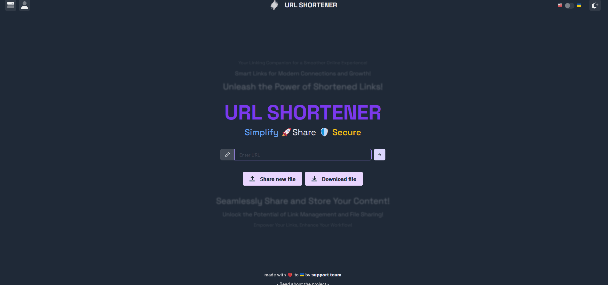
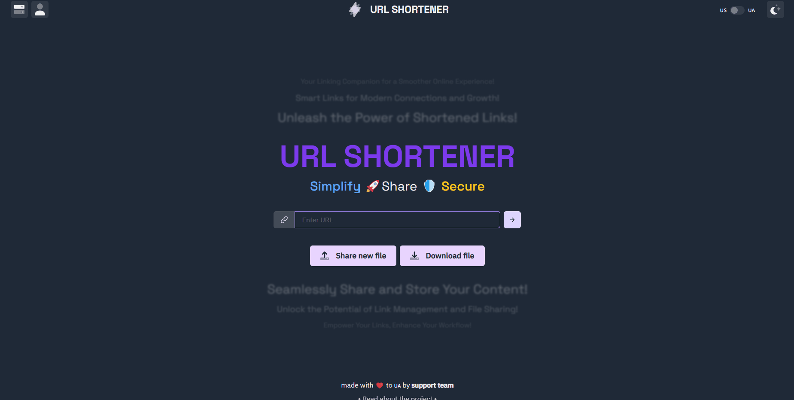

<div align='center'>

# ⚡️ URL SHORTENER

||
|:---:|
||
||
**Проект створений командою URL SHORTENER**
  
### [Перевірити](https://kyarick.github.io/UrlShortener/) | [Дізнатися, як це працює](https://github.com/kYaRick/UrlShortener/wiki) | [Підтримати проект](https://github.com/kYaRick/UrlShortener)
  
</div>

<br />

---
### Можеш обрати мову
<a href="./README.md">
  
</a>
<a href="./README_ENG.md">
  
</a>

<br />

# 👋 Вступ

URL Shortener є веб-додатком, який дозволяє користувачам створювати скорочені URL-адреси для довгих посилань. Він забезпечує зручний спосіб навігації в Інтернеті шляхом генерації коротких та легко піддаються поширенню URL-адрес.

### 🔄 Історія змін

Для детальної історії змін, будь ласка, зверніться до [історії комітів](https://github.com/kYaRick/UrlShortener/commits/develop).

### 🚀 Особливості

- Скорочення довгих URL-адрес в короткі та зручні посилання.
- Персоналізовані короткі URL-адреси для кожного користувача.
- Перегляд статистики та аналітики користувача.
- Легке використання та налаштування.
- Можливість розгорнути власну ноду.

### 🚧 Обмеження

- Омбеження розміру файла у 20МБ
- URL переадресація працює тільки при правильному налаштуванні сервера.

### 🌟 Переваги

- Простий та інтуїтивно зрозумілий інтерфейс користувача.
- Швидке та ефективне скорочення URL-адрес.
- Компактний розмір коду та оптимізована продуктивність.

### 🛠️ Встановлення та використання

1. Клонуйте репозиторій:

```bash
git clone https://github.com/kYaRick/UrlShortener.git
```

2. Встановіть залежності:

```bash
cd UrlShortener
yarn
```

3. Налаштуйте файл config.js відповідно до вашого розпорядку.

    Запуск додатоку:

```bash
yarn build
yarn dev
```

#### Результат інсталяції:
```bash
C:\UrlShortener>yarn && yarn build && yarn dev
yarn install v1.22.19
[1/4] Resolving packages...
success Already up-to-date.
Done in 0.29s.
yarn run v1.22.19
$ tsc && vite build
vite v4.3.8 building for production...
✓ 1064 modules transformed.
build/manifest.webmanifest                          0.76 kB
build/index.html                                    1.01 kB │ gzip:   0.49 kB
build/assets/apple-touch-icon-d4eb60a4.png         12.04 kB
build/assets/kYaRick-e7f7cce9.jpg                  16.89 kB
build/assets/Misha-da693569.jpg                    19.90 kB
build/assets/favicon-e7e60b83.png                  21.55 kB
build/assets/Anya-861598a1.jpg                    153.88 kB
build/assets/upload-c427d3be.css                    3.29 kB │ gzip:   1.04 kB
build/assets/index-f39ba9d0.css                    17.80 kB │ gzip:   3.54 kB
build/assets/download-72783f9e.js                   1.47 kB │ gzip:   0.81 kB
build/assets/file-896554eb.js                       1.49 kB │ gzip:   0.81 kB
build/assets/react-filepond.esm-5838f230.js         1.73 kB │ gzip:   0.86 kB
build/assets/server-93e8f740.js                     3.30 kB │ gzip:   1.64 kB
build/assets/auth-d9bd02f1.js                       4.52 kB │ gzip:   2.14 kB
build/assets/workbox-window.prod.es5-dc90f814.js    5.29 kB │ gzip:   2.20 kB
build/assets/file-62202484.js                       5.82 kB │ gzip:   2.47 kB
build/assets/upload-c4195b06.js                   124.80 kB │ gzip:  41.36 kB
build/assets/index-690cba87.js                    525.40 kB │ gzip: 174.85 kB
build/assets/firebase-8d1cee96.js                 704.65 kB │ gzip: 161.84 kB

(!) Some chunks are larger than 500 kBs after minification. Consider:
- Using dynamic import() to code-split the application
- Use build.rollupOptions.output.manualChunks to improve chunking: https://rollupjs.org/configuration-options/#output-manualchunks
- Adjust chunk size limit for this warning via build.chunkSizeWarningLimit.

PWA v0.14.7
mode      generateSW
precache  14 entries (1372.07 KiB)
files generated
  build\sw.js
  build\workbox-3625d7b0.js
✓ built in 8.41s
Done in 10.41s.
```

4. Можете перевіряти у вашому веб-браузері.

```bash
yarn run v1.22.19
$ vite

  VITE v4.3.8  ready in 457 ms

  ➜  Local:   http://localhost:5173/UrlShortener/
  ➜  Network: use --host to expose
  ➜  press h to show help
```

### ❤️ Підтримайте проект

Якщо вам подобається цей проект та ви бажаєте підтримати його активний розвиток:

    Поставте ⭐️ проекту на GitHub!
    Залиште коментар або реакцію на пояснення, як цей проект був створений!

Дякуємо вам за інтерес до підтримки URL Shortener!

#### Примітка:
> Цей проект все ще знаходиться в розробці, і будь-які відгуки або внески високо цінуються.  Будь ласка, повідомляйте про будь-які проблеми чи пропозиції через репозиторій на GitHub.