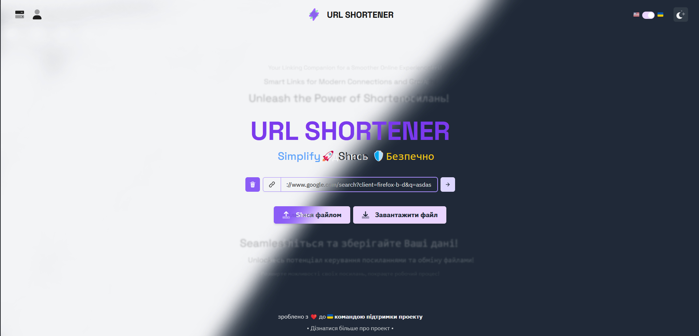
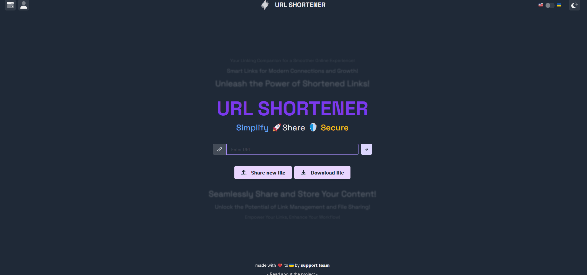
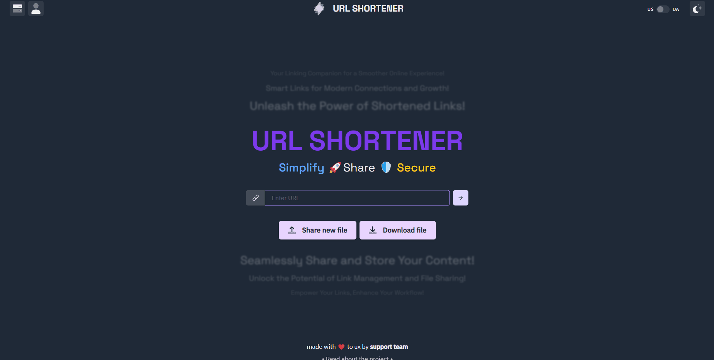

<div align='center'>
  
# ⚡️ URL SHORTENER
||
|:---:|
||
||
**a project created by [URL SHORTENER TEAM](#)**
  
### [Check it out](https://kyarick.github.io/UrlShortener/) | [Learn how it's made](https://github.com/kYaRick/UrlShortener/wiki) | [Support the project](https://github.com/kYaRick/UrlShortener)
  
</div>

---

<br />

# 👋 Introduction

"Url shortener" is a file hosting and sharing service powered by [Firebase](https://firebase.google.com). Users can upload files under 20MB and download hosted files using a "share code" (a short 3 word code provided by [words-aas](https://github.com/chroline/words-aas)). After uploading a file, the file uploader can retrieve the share code and share it with others or delete the file at any time. Files will automatically be deleted after 21 days (WIP).

### 🔄 Changelog

For a detailed changelog, please refer to the [commit history](https://github.com/kYaRick/UrlShortener/commits/develop).

### 🚀 Features

- Shorten long URLs into short and convenient links.
- Personalized short URLs for each user.
- User statistics and analytics.
- Easy to use and configure.
- Option to deploy your own instance.

### 🚧 Limitations

- File size limit of 20MB.
- URL redirection works only with proper server configuration.

### 🌟 Benefits

- Simple and intuitive user interface.
- Fast and efficient URL shortening.
- Compact code size and optimized performance.

### 🛠️ Installation and Usage

1. Clone the repository:

# 🧑‍💻 Development

1. 📂 Clone this repo

2. 📦 Install dependencies with `yarn`

3. 🏃 Start the Vite dev server with `yarn dev`

4. 🌎 Visit the provided link in your browser

## Firebase

Firebase is used to power the authentication, database, and file storage for URL SHORTENER. For security reasons, the production LIGHTING SHARE Firebase project is not available for local development on `localhost`. As such, you will need to create your own Firebase project for local development purposes.

On your development Firebase project:

1. Enable anonymous authentication.
2. Ensure `localhost` is an authorized domain for authentication.
3. Enable Firestore Database and Storage features.

Replace the `firebaseConfig` variable in `src/util/firebase-config.ts` with the config for your Firebase project.

## Step by step

1. 📂 Clone the repository.

```bash
git clone https://github.com/kYaRick/UrlShortener.git
```

2. 📦 Install dependencies.

```bash
cd UrlShortener
yarn
```

3. ⚙️ Configure the config.js file according to your environment.

    Start node:

```bash
yarn build
yarn dev
```

#### Shell results:
```bash
C:\UrlShortener>yarn && yarn build && yarn dev
yarn install v1.22.19
[1/4] Resolving packages...
success Already up-to-date.
Done in 0.29s.
yarn run v1.22.19
$ tsc && vite build
vite v4.3.8 building for production...
✓ 1064 modules transformed.
build/manifest.webmanifest                          0.76 kB
build/index.html                                    1.01 kB │ gzip:   0.49 kB
build/assets/apple-touch-icon-d4eb60a4.png         12.04 kB
build/assets/kYaRick-e7f7cce9.jpg                  16.89 kB
build/assets/Misha-da693569.jpg                    19.90 kB
build/assets/favicon-e7e60b83.png                  21.55 kB
build/assets/Anya-861598a1.jpg                    153.88 kB
build/assets/upload-c427d3be.css                    3.29 kB │ gzip:   1.04 kB
build/assets/index-f39ba9d0.css                    17.80 kB │ gzip:   3.54 kB
build/assets/download-72783f9e.js                   1.47 kB │ gzip:   0.81 kB
build/assets/file-896554eb.js                       1.49 kB │ gzip:   0.81 kB
build/assets/react-filepond.esm-5838f230.js         1.73 kB │ gzip:   0.86 kB
build/assets/server-93e8f740.js                     3.30 kB │ gzip:   1.64 kB
build/assets/auth-d9bd02f1.js                       4.52 kB │ gzip:   2.14 kB
build/assets/workbox-window.prod.es5-dc90f814.js    5.29 kB │ gzip:   2.20 kB
build/assets/file-62202484.js                       5.82 kB │ gzip:   2.47 kB
build/assets/upload-c4195b06.js                   124.80 kB │ gzip:  41.36 kB
build/assets/index-690cba87.js                    525.40 kB │ gzip: 174.85 kB
build/assets/firebase-8d1cee96.js                 704.65 kB │ gzip: 161.84 kB

(!) Some chunks are larger than 500 kBs after minification. Consider:
- Using dynamic import() to code-split the application
- Use build.rollupOptions.output.manualChunks to improve chunking: https://rollupjs.org/configuration-options/#output-manualchunks
- Adjust chunk size limit for this warning via build.chunkSizeWarningLimit.

PWA v0.14.7
mode      generateSW
precache  14 entries (1372.07 KiB)
files generated
  build\sw.js
  build\workbox-3625d7b0.js
✓ built in 8.41s
Done in 10.41s.
```

# ❤️ Support this project

If you want to say thank you and/or support active development of our team:

- Add a GitHub Star to the project!
- Leave a comment or a reaction on the tutorial of how this project was built!

Thanks so much for your interest in supporting URL SHORTENER!
